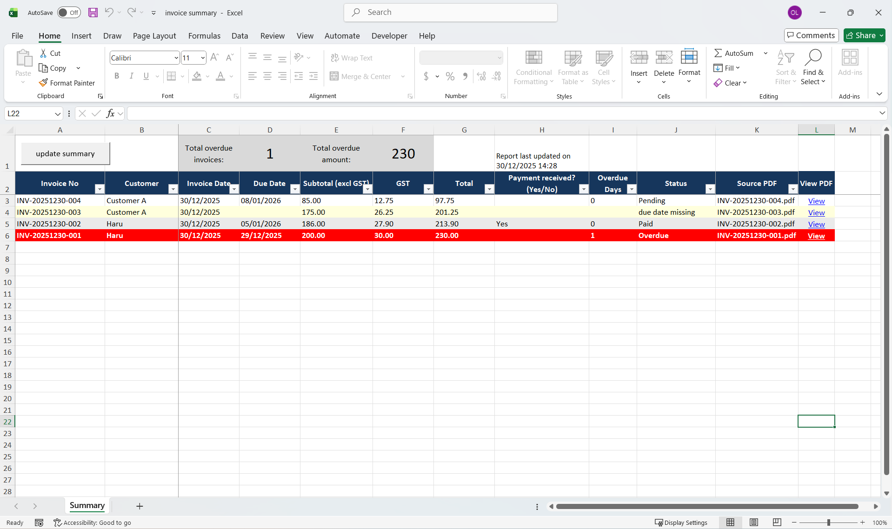

# Optee Invoice Tracker

An Excel-based invoice & payment tracking tool for small businesses.

Stop manually tracking invoices.
Create invoices in Excel and get an auto-generated summary — no subscriptions, no cloud.

## What it does
- Automatic invoice numbering
- Auto-generated summary from all invoices
- No manual data entry — rebuild the summary anytime
- Local files only (offline, no accounts)

## Who this is for
- Small businesses just getting started
- Anyone using Excel for invoicing
- Users who want simple, local, subscription-free tools

## Getting started
See the Quick Start Guide:
Quick Start Guide.pdf

## Notes
This tool uses Excel macros.
Please follow the setup instructions carefully.
